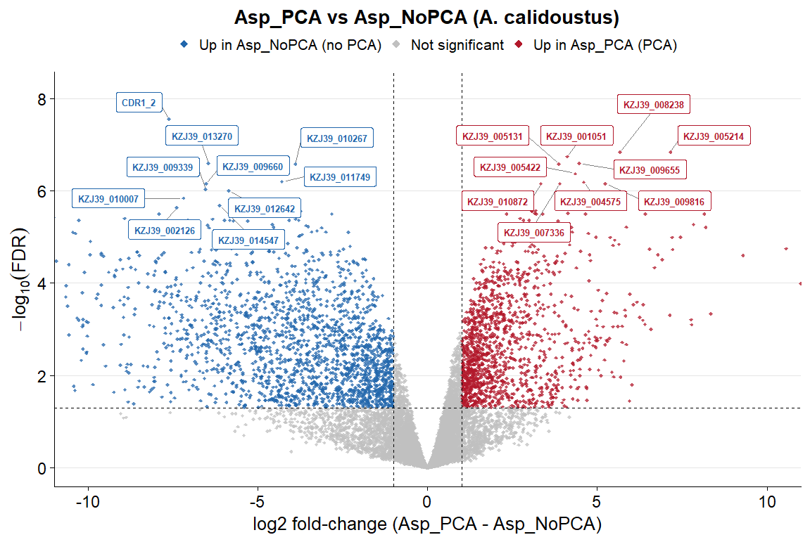
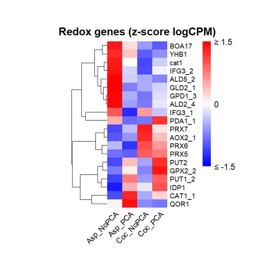

# PCA-Dependent Coculture RNA-seq Analysis

***Aspergillus calidoustus* – *Paraburkholderia edwinii***

This repository contains a reproducible bulk RNA-seq analysis pipeline used to study fungal transcriptional responses to coculture and phenazine carboxylic acid (PCA) stress, with a focus on **Aspergillus calidoustus**.

The workflow includes quality control, trimming, genome annotation, alignment, gene-level quantification, and differential expression analysis using edgeR.

---

## Experimental Design

Single-end Illumina RNA-seq libraries were generated for **Aspergillus calidoustus** grown under the following conditions:

- Monoculture vs coculture with **Paraburkholderia edwinii**
- PCA-treated vs untreated
- Biological replicates per condition

Differential expression analysis focuses on **fungal genes only**.

---

## Repository Structure

```text
scripts/
├── 01_fastqc_raw_multiqc.sbatch
├── 02_fastp_trim_and_qc.sbatch
├── 03_funannotate_train_container_mysql.sbatch
├── 04_funannotate_predict.sbatch
├── 05_funannotate_annotate_rename_KZJ39.sbatch
├── 06_build_Acal_master_table.sbatch
├── 07a_star_index_combined.sbatch
├── 07b_star_align_combined_se.sbatch
├── 08star_featureCounts_fungal.sbatch
├── 09_edger_ql_fungus.sbatch
└── export_funannotate_master_table.py

results/
├── edgeR_tables/
├── volcano_plots/
└── heatmaps/
```

---

## Pipeline Overview

1. Quality control of raw reads using FastQC and MultiQC  
2. Adapter trimming and filtering using fastp  
3. Genome annotation using Funannotate (training, prediction, annotation)  
4. STAR alignment to a combined fungal + bacterial genome  
5. Fungal gene-level quantification using featureCounts  
6. Differential expression analysis using edgeR (quasi-likelihood framework)  

Results
Differential expression analysis across PCA stress and coculture conditions

To characterize transcriptional responses of *Aspergillus calidoustus* under phenazine (PCA) stress and bacterial coculture, we performed differential expression analysis using edgeR across four biologically relevant contrasts representing both stress and interaction effects:

- **AspPCA vs AspNoPCA** – effect of PCA stress on *A. calidoustus* in monoculture  
- **CocPCA vs CocNoPCA** – effect of PCA stress during coculture  
- **AspPCA vs CocPCA** – effect of coculture under PCA stress  
- **AspNoPCA vs CocNoPCA** – effect of coculture in the absence of PCA

For each contrast, gene-level differential expression statistics (log₂ fold change, dispersion, and adjusted p-values) were computed and filtered to produce GeneID-only result tables.

Final edgeR result tables: [`results/edgeR_tables/`](results/edgeR_tables/)  
Global transcriptional shifts revealed by volcano plots

Volcano plots were generated for each contrast to visualize the overall magnitude and significance of differential expression. These plots highlight widespread transcriptional remodeling in response to both PCA stress and coculture, with distinct subsets of genes showing strong up- or down-regulation depending on condition.

Notably:

PCA stress induces a pronounced transcriptional response in monoculture, which is further modulated during coculture.

Coculture effects differ substantially between PCA and No-PCA conditions, suggesting condition-dependent microbial interactions.

 Volcano plots: [`results/volcano_plots/`](results/volcano_plots/)  
Functional category–specific responses under stress and interaction

#### Example volcano plot (AspPCA vs AspNoPCA)




To interpret biological function, differentially expressed genes were grouped into curated functional categories and visualized using heatmaps. These analyses reveal coordinated regulation of genes involved in stress response, secretion, and metabolism.

Key functional patterns include:

Redox and oxidative stress–related genes showing strong regulation under PCA exposure

Membrane and transporter genes suggesting altered efflux and nutrient exchange during coculture

Secreted proteins and proteases indicating potential interaction-mediated remodeling of the extracellular environment

CAZymes reflecting changes in carbohydrate metabolism and cell wall dynamics

These functional trends suggest that A. calidoustus mounts both protective and adaptive responses when exposed to phenazine stress, and that these responses are reshaped in the presence of the bacterial partner.

Functional category heatmaps: [`results/heatmaps/`](results/heatmaps/)

#### Example functional category heatmap (Redox)



### Summary and biological interpretation

Together, these results demonstrate that:

PCA stress and coculture each drive distinct but overlapping transcriptional programs in A. calidoustus.

Coculture modifies the fungal stress response rather than simply amplifying or suppressing it.

Functional category analysis highlights biologically meaningful pathways likely involved in stress tolerance and interspecies interaction.

These findings provide a transcriptomic framework for understanding fungal adaptation under chemical stress and microbial interaction conditions.

---

## Author

**Renuka Reddy Namala**  
Bioinformatics & Computational Biology  
University of Georgia
